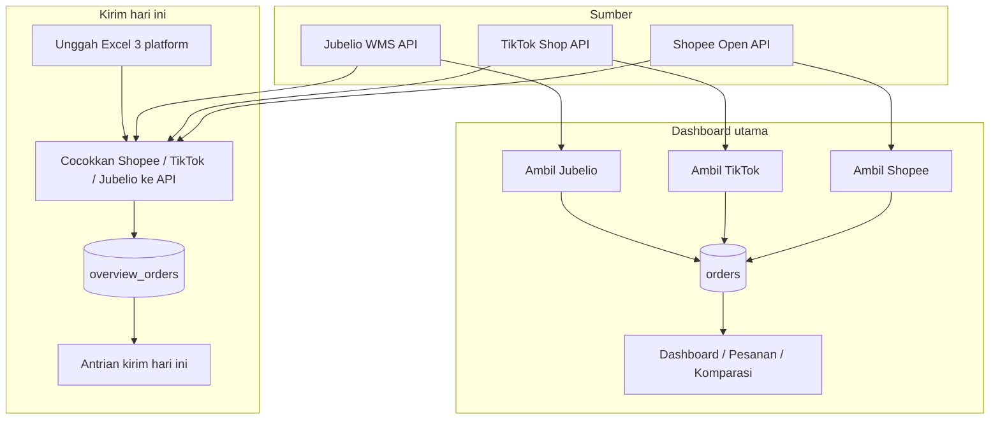
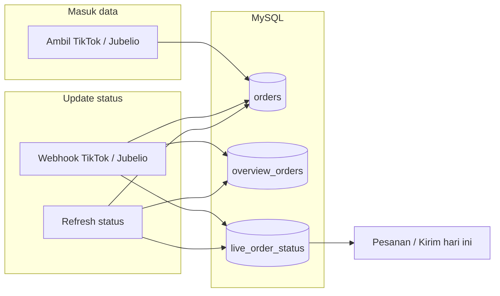
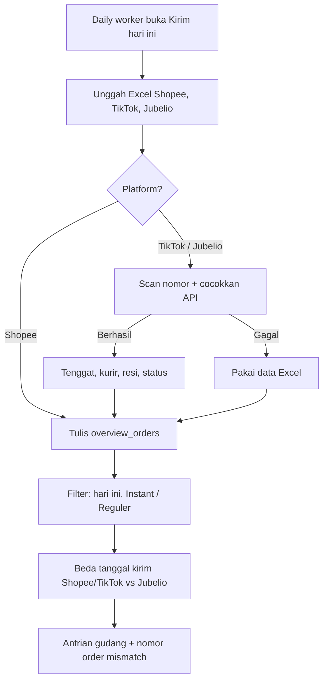
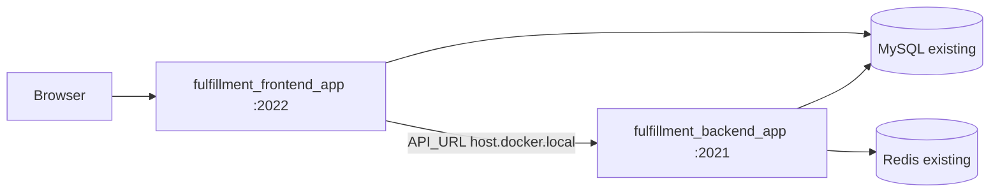

# Order Dashboard - Aeris Beaute Fulfillment

Dashboard webapp untuk mengelola dan menganalisis data order dari marketplace **Shopee** dan **TikTok Shop / Tokopedia**. **Jubelio** dipakai sebagai cermin omnichannel (WMS), bukan saluran penjualan tambahan: untuk memantau yang miss atau belum realtime. Order Shopee, TikTok, dan Tokopedia ditarik dari API masing-masing (Excel Shopee tetap bisa sebagai cadangan). Order Jubelio ditarik dari **Jubelio WMS API**.

Penyimpanan di **MySQL** (`fulfillment_db`): dashboard utama memakai tabel `orders`, halaman **Kirim hari ini** memakai tabel terpisah `overview_orders`. Auth memakai cookie + tabel `users` (bukan Supabase). Cache dashboard Nest memakai **Redis** yang sudah running (bukan Upstash).

**Live**: [fulfillment-fti.aerisbeaute.com](https://fulfillment-fti.aerisbeaute.com)

## Alur sistem

Dua jalur data, dua tabel. Dashboard utama dan Kirim hari ini tidak saling menimpa.



### Status live

Ambil data tidak mengupdate status di request yang sama. Status menyusul dari webhook dan refresh periodik.



### Kirim hari ini — unggah harian



## Fitur

### Navigasi
- **Dashboard**: Kartu ringkasan + grafik (tren, platform, status)
- **Pesanan**: Tabel order dengan filter, pencarian, dan pagination
- **Komparasi**: Cermin Jubelio vs Shopee / TikTok (miss / delay realtime)
- **Settings**: Hubungkan & Ambil Shopee / TikTok / Jubelio, profil, password, kelola user
- **Kirim hari ini**: Antrian gudang terpisah (`/overview-duedate`) — dari sidebar terbuka di tab baru
- **Scanner barcode**: Validasi scan kirim hari ini (`/scanner-barcode`)

### Sumber Data
- **Shopee**: Sync API — tarik order siap dikirim (`get_shipment_list`), diproses, dan selesai 30 hari (`get_order_list`). Hubungkan toko sekali di Settings
- **TikTok & Tokopedia**: Sync API — tarik order siap dikirim (`AWAITING_SHIPMENT` + `AWAITING_COLLECTION`) dan order **selesai** (`COMPLETED` + `DELIVERED`, 30 hari terakhir). Channel dibaca dari `commerce_platform` (`TIKTOK_SHOP` / `TOKOPEDIA`)
- **Jubelio**: Sync API — tarik order Siap Kirim (`channel_status` Ready To Ship) sebagai **cermin WMS**, tidak dijumlahkan ke total penjualan
- Status live mengikuti webhook Shopee / TikTok / Jubelio dan `/api/refresh-status`
- **Kirim hari ini**: Excel/CSV dari 3 platform; antrian kirim dari Shopee & TikTok; Jubelio dicocokkan sebagai cermin

### Dashboard
- Total order, pendapatan, item terjual, dan rata-rata order
- Breakdown per platform (Shopee, TikTok & Tokopedia). Jubelio tidak masuk kartu/grafik penjualan
- Grafik tren pendapatan, distribusi platform, distribusi status
- Data dashboard dibaca lewat Nest `GET /v1/dashboard` (cache Redis), fallback ke `/api/v1/dashboard` di Next

### Pesanan
- Filter platform: Channel (marketplace) | Shopee | TikTok & Tokopedia | Jubelio (cermin WMS, tidak masuk tab Channel)
- Tab **Belum Bayar** tetap ada; **Order hari ini** hanya yang sudah bayar. Cancel tidak masuk order hari ini — masuk chart/log `cancel_alerts`
- Filter status: Belum Bayar, Perlu Dikirim, Dikirim, Selesai, Batal, Retur
- Sub-filter pengiriman: Instant / Reguler
- Satu order multi-SKU tampil sebagai 1 baris
- Sorting, pencarian, indikator batas kirim, pagination
- Timezone: `Asia/Jakarta` (UTC+7)

### Komparasi
- Cermin omnichannel: Jubelio vs marketplace via order number, ref number, atau tracking number
- Tidak ada tab Penjualan
- Filter: Dikirim hari ini · Ada di toko belum di Jubelio · Ada di Jubelio saja · Beda data

### Kirim hari ini (`/overview-duedate`)
Halaman kerja daily warehouse. **Data terpisah dari dashboard utama** (MySQL `overview_orders` / `overview_files`, bukan tabel `orders`). Import / hapus di sini tidak mengubah Settings, Pesanan, atau Komparasi.

**Cutoff Order hari ini (SOP)**
- Shopee reguler + instant: 15.01
- TikTok / Tokopedia reguler: 15.01
- TikTok / Tokopedia instant: 17.01

**Yang ditampilkan**
- Hanya pesanan yang perlu dikirim **hari ini**
- Kartu: Perlu dikirim hari ini · Wajib dikirim sekarang · Shopee · TikTok / Tokopedia · Belum di Jubelio
- Shopee Regular / Hemat / Next Day mengikuti SLA toko
- Instant hanya jika order benar-benar instant
- Packing cicil: 1 order bisa punya lebih dari satu identitas resi marketplace

Timezone tenggat: `Asia/Jakarta`. Tombol **Hapus data halaman ini** hanya mengosongkan tabel overview.

### Autentikasi & Keamanan
- Login: email/username + password (cookie httpOnly)
- Cloudflare Turnstile di login (wajib di production)
- User harus didaftarkan admin sebelum bisa login
- **Admin**: akses penuh + kelola user
- **Warehouse**: akses penuh, data keuangan disembunyikan
- Seed lokal (kalau tabel `users` kosong): `it@aerisbeaute.com` / `itaeris`
- Login Google sudah tidak dipakai

### Shopee Open API
- Hubungkan toko sekali di Settings → **Hubungkan toko** (OAuth Seller Centre). Kode otorisasi kadaluarsa **10 menit**
- Access token API habis ~4 jam; app memperbarui otomatis lewat `refresh_token` (~30 hari)
- Token disimpan di MySQL `shopee_tokens` (+ cache file lokal)
- Redirect domain: `{origin}` — callback `{origin}/api/shopee/callback`
- **Ambil Shopee** hanya menambah order baru. Update status menyusul dari webhook / refresh
- Webhook: `POST /api/shopee/webhook`

### TikTok Shop API
- Hubungkan toko sekali di Settings → **Hubungkan TikTok**
- Access token API habis ~4 jam; diperbarui lewat `refresh_token`
- Token disimpan di MySQL `tiktok_tokens`
- Redirect URL: `{origin}/api/tiktok/callback`
- Webhook: `POST /api/tiktok/webhook`

### Jubelio WMS API
- Login `POST https://api2.jubelio.com/login` ([docs](https://docs-wms.jubelio.com/))
- Token kadaluarsa 12 jam; disimpan di MySQL `jubelio_tokens`
- Kredensial hanya di env (`JUBELIO_EMAIL`, `JUBELIO_PASSWORD`)
- Webhook: `POST /api/jubelio/webhook?secret=...`

## Tech Stack

- **Frontend**: Next.js 14 (App Router, `output: "standalone"`) di root repo
- **Backend**: NestJS 10 (Express) di `apps/api` — `GET /v1/dashboard`, `GET /v1/health`
- **Language**: TypeScript
- **Styling**: Tailwind CSS
- **Database**: MySQL 8 (`mysql2`) — container yang sudah running, tidak dibuat pipeline
- **Cache**: Redis (ioredis) — container yang sudah running, bukan Upstash
- **Auth**: cookie + bcrypt, tabel `users`
- **Charts**: Recharts
- **Excel**: xlsx (SheetJS)
- **Hosting**: Docker (NGINX di dalam image frontend + backend) + GitHub Actions → Docker Hub

Tidak memakai Vercel, Supabase, atau Upstash.

## Getting Started

### Prerequisites

- Node.js 18+
- npm
- MySQL 8 yang sudah running (`fulfillment_db`)
- Redis yang sudah running (opsional; tanpa Redis cache fallback ke memory)
- Aplikasi TikTok Shop di [Partner Center](https://partner.tiktokshop.com/)
- Aplikasi Shopee di [Open Platform](https://open.shopee.com/)

### Installation

```bash
npm install
cp .env.example .env
cp apps/api/.env.example apps/api/.env
```

Jangan commit `.env` / `apps/api/.env`.

Lokal: `MYSQL_HOST=127.0.0.1`, `REDIS_HOST=127.0.0.1`, `NEXT_PUBLIC_API_URL=http://localhost:4000`.

### Database

Schema: [`docker/mysql/init.sql`](docker/mysql/init.sql). Pipeline tidak membuat container DB — connect ke MySQL/MariaDB yang sudah running.

Setiap deploy selalu cek migrate: table/kolom baru ditambah, yang sudah ada di-skip (bukan error). Lokal:

```bash
npm run db:migrate
```

Kalau `users` kosong, seed admin: `itaeris` / `it@aerisbeaute.com`.

Tabel utama: `orders`, `uploaded_files`, `overview_orders`, `overview_files`, `live_order_status`, `overdue_scans`, `cancel_alerts`, `users`, `tiktok_tokens`, `shopee_tokens`, `jubelio_tokens`.

### Run lokal

```bash
npm run dev
```

Web: [http://localhost:3000](http://localhost:3000)  
Nest: [http://localhost:4000/v1/health](http://localhost:4000/v1/health)

Hanya frontend: `npm run dev:web`. Hanya API: `npm run dev:api`.

### Webhook & OAuth URL

Di Open Platform Shopee, Redirect URL Domain:

```
https://fulfillment-fti.aerisbeaute.com
```

Webhook Shopee / TikTok / Jubelio:

```
https://fulfillment-fti.aerisbeaute.com/api/shopee/webhook
https://fulfillment-fti.aerisbeaute.com/api/tiktok/webhook
https://fulfillment-fti.aerisbeaute.com/api/jubelio/webhook?secret=<JUBELIO_WEBHOOK_SECRET>
```

Lokal: `http://localhost:3000/` + path callback masing-masing.

## Docker & CI/CD

Tidak memakai docker-compose. Image di-build GitHub Actions, di-push ke Docker Hub, lalu `docker run` di server.

| | Frontend | Backend |
|---|---|---|
| Image | `itaeris/fulfillment_frontend_app` | `itaeris/fulfillment_backend_app` |
| Container | `fulfillment_frontend_app` | `fulfillment_backend_app` |
| Port host | **2022** | **2021** |
| Domain | `https://fulfillment-fti.aerisbeaute.com` | alias `host.docker.local` di network |

Network: `fulfillment-network`. NGINX ada di **kedua** image. Deploy **tidak** membuat container MySQL/Redis — isi `MYSQL_HOST` / `REDIS_HOST` dengan nama container yang sudah jalan.



Workflow: [`.github/workflows/docker.yml`](.github/workflows/docker.yml)  
Deploy script: [`docker/deploy.sh`](docker/deploy.sh)

### GitHub Secrets

| Secret | Isi |
|--------|-----|
| `DOCKERHUB_USERNAME` | username Docker Hub |
| `DOCKERHUB_TOKEN` | token Docker Hub |
| `NEXT_PUBLIC_TURNSTILE_SITE_KEY` | site key Turnstile (build-arg frontend) |
| `BACKEND_ENV` | env multiline untuk kedua container (lihat `docker/backend.env.example`) |

Deploy job jalan di **self-hosted runner** di CasaOS (bukan SSH dari GitHub). Tunnel `ssh.aerisbeaute.com` tidak membuka port 22 ke internet, jadi `SERVER_HOST` / `SERVER_SSH_KEY` tidak dipakai pipeline.

`BACKEND_ENV` berisi MySQL, Redis, `SESSION_SECRET`, `TURNSTILE_SECRET_KEY`, Shopee / TikTok / Jubelio. Jangan isi `NEXT_PUBLIC_API_URL` (Docker mengosongkannya; browser same-origin, Next → Nest via `API_URL=http://host.docker.local`).

Jangan masukkan `SUPABASE_*` / `UPSTASH_*`.

Pasang runner sekali di CasaOS: repo → Settings → Actions → Runners → New self-hosted runner (Linux x64). Label default `self-hosted` + `linux`. Biarkan process-nya jalan terus.

### Cloudflare Turnstile

`NEXT_PUBLIC_TURNSTILE_SITE_KEY` di-bake saat **build image**. Setelah ganti site key, harus rebuild/push image. Hostname widget: `fulfillment-fti.aerisbeaute.com` (+ `localhost` untuk tes).

## Cara Penggunaan

### Import & Sync

**Dashboard utama (Settings / Pesanan / Komparasi)**

| Platform | Sumber | Cara |
|----------|--------|------|
| Shopee | Shopee Open API (siap kirim + diproses + selesai 30 hari) | Settings → Hubungkan Shopee (sekali) → Ambil Shopee |
| Jubelio | Jubelio WMS API (Shipping → Siap Kirim) | Settings / Pesanan / Komparasi → Ambil Jubelio |
| TikTok & Tokopedia | TikTok Shop API (To Ship + Selesai 30 hari) | Settings → Hubungkan TikTok (sekali) → Ambil TikTok |

**Ambil Shopee / Ambil TikTok** menambah order baru saja; status *Terkirim / Selesai* menyusul dari webhook dan refresh.

**Kirim hari ini (terpisah)**

| Platform | Sumber | Cara |
|----------|--------|------|
| Shopee | Export Excel/CSV toko (cadangan) | Unggah Excel/CSV → otomatis dicocokkan API |
| TikTok & Tokopedia | Export Excel/CSV toko | Unggah Excel/CSV → otomatis dicocokkan API |
| Jubelio | Export Excel/CSV gudang (cermin, bukan antrian tambahan) | Unggah Excel/CSV → otomatis dicocokkan API |

### User Management

- Admin membuat user di **Settings > Kelola User > Tambah User**
- Admin bisa mengubah role dan menghapus user
- Ubah password di Settings → Ubah Password

## Struktur Project

```
.github/workflows/docker.yml      # Build + push Docker Hub + SSH deploy
apps/api/                         # NestJS
├── src/dashboard/                # GET /v1/health, GET /v1/dashboard
├── src/cache.ts                  # Redis + memory
└── src/mysql.ts
docker/
├── deploy.sh                     # docker run (tanpa compose, tanpa create MySQL/Redis)
├── backend/                      # Dockerfile + NGINX Nest
├── frontend/                     # Dockerfile + NGINX Next standalone
├── backend.env.example
└── mysql/init.sql                # Schema (auto-migrate saat start)
src/
├── app/
│   ├── api/                      # Route Next (auth, sync, webhook, overview, scan)
│   ├── login/
│   ├── overview-duedate/
│   ├── scanner-barcode/
│   └── page.tsx
├── components/
├── contexts/AuthContext.tsx      # Cookie session
└── lib/
    ├── sql.ts                    # Pool MySQL + query builder
    ├── schema.ts                 # ensure tables + seed admin
    ├── db.ts
    ├── client-data.ts            # Fetch Nest / API, tanpa mysql2 di browser
    └── overview-store.ts         # Tulis overview lewat /api/overview/*
```

## Format Kolom Excel yang Didukung

| Field | Shopee | TikTok Shop (legacy export) | Jubelio |
|-------|--------|-----------------------------|---------|
| No. Pesanan | No. Pesanan | Order ID | salesorder_no |
| Status | Status Pesanan | Order Status | channel_status |
| Customer | Username (Pembeli) | Buyer Username | customer_name |
| Produk | Nama Produk | Product Name | - |
| SKU | Nomor Referensi SKU | Seller SKU | - |
| Qty | Jumlah | Quantity | qty / total_qty |
| Harga | Harga Setelah Diskon | SKU Subtotal After Discount | dihitung dari grand_total ÷ qty kalau kolom harga kosong |
| Total | Total Pembayaran | Order Amount | grand_total |
| Tanggal | Waktu Pesanan Dibuat | Created Time | transaction_date |
| Batas Kirim | Pesanan Harus Dikirimkan Sebelum | - | due_date |
| No. Resi | No. Resi | Tracking ID | tracking_no |
| Kurir | Opsi Pengiriman | Shipping Provider Name | shipper |
| Ref No | - | - | ref_no |
| Pickup Time | - | RTS Time | pickup_time_store |

Angka Excel dibaca beda untuk qty vs uang: qty `40.000` = 40 item; uang `149.000` = Rp 149.000. Total di preview = harga satuan × qty (bukan Total Pembayaran Shopee, yang sudah dipotong voucher/koin).

## License

MIT
