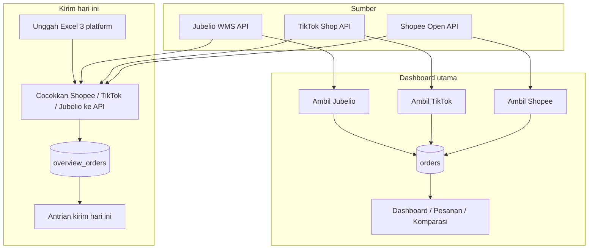
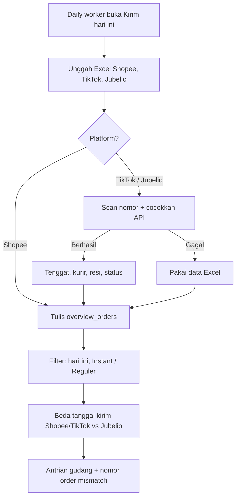

# Order Dashboard - Aeris Beaute Fulfillment

Dashboard webapp untuk mengelola dan menganalisis data order dari marketplace **Shopee** dan **TikTok Shop / Tokopedia**. **Jubelio** dipakai sebagai cermin omnichannel (WMS), bukan saluran penjualan tambahan: untuk memantau yang miss atau belum realtime. Order Shopee, TikTok, dan Tokopedia ditarik dari API masing-masing (Excel Shopee tetap bisa sebagai cadangan). Order Jubelio ditarik dari **Jubelio WMS API**. Penyimpanan di **Supabase** (PostgreSQL): dashboard utama memakai tabel `orders`, halaman **Kirim hari ini** memakai tabel terpisah `overview_orders`.

**Live**: [fulfillment-fti.aerisbeaute.com](https://fulfillment-fti.aerisbeaute.com)

## Alur sistem

Dua jalur data, dua tabel. Dashboard utama dan Kirim hari ini tidak saling menimpa.



### Status live

Ambil data tidak mengupdate status di request yang sama. Status menyusul dari webhook dan cron.


### Kirim hari ini — unggah harian



## Fitur

### Navigasi
- **Dashboard**: Kartu ringkasan + grafik (tren, platform, status)
- **Pesanan**: Tabel order dengan filter, pencarian, dan pagination
- **Komparasi**: Cermin Jubelio vs Shopee / TikTok (miss / delay realtime)
- **Settings**: Hubungkan & Ambil Shopee / TikTok / Jubelio, Excel Shopee cadangan, export, reset data, profil, password, kelola user
- **Kirim hari ini**: Antrian gudang terpisah (`/overview-duedate`) — dari sidebar terbuka di tab baru

### Sumber Data
- **Shopee**: Sync API — tarik order siap dikirim (`get_shipment_list`), diproses, dan selesai 30 hari (`get_order_list`). Hubungkan toko sekali di Settings
- **TikTok & Tokopedia**: Sync API — tarik order siap dikirim (`AWAITING_SHIPMENT` + `AWAITING_COLLECTION`) dan order **selesai** (`COMPLETED` + `DELIVERED`, 30 hari terakhir). Channel dibaca dari `commerce_platform` (`TIKTOK_SHOP` / `TOKOPEDIA`)
- **Jubelio**: Sync API — tarik order Siap Kirim (`channel_status` Ready To Ship) sebagai **cermin WMS**, tidak dijumlahkan ke total penjualan
- Status live mengikuti webhook Shopee / TikTok / Jubelio dan cron 15 menit (`/api/refresh-status`)
- **Kirim hari ini**: Excel/CSV dari 3 platform; antrian kirim dari Shopee & TikTok; Jubelio dicocokkan sebagai cermin. Unggahan Shopee/TikTok/Jubelio dicocokkan ke API

### Dashboard
- Total order, pendapatan, item terjual, dan rata-rata order
- Breakdown per platform (Shopee, TikTok & Tokopedia). Jubelio tidak masuk kartu/grafik penjualan
- Grafik tren pendapatan, distribusi platform, distribusi status
- Data dibaca langsung dari Supabase (paralel), disimpan di memori sesi supaya pindah menu tidak fetch ulang

### Pesanan
- Filter platform: Semua (marketplace) | Shopee | TikTok & Tokopedia | Jubelio (cermin WMS, tidak masuk tab Semua)
- Sub-filter TikTok & Tokopedia: Semua | TikTok Shop by Tokopedia | Tokopedia
- Filter status: Belum Bayar, Perlu Dikirim, Dikirim, Selesai, Batal/Retur
- Sub-filter pengiriman: Instant / Reguler
- Sub-filter pickup: Sebelum Pickup, Sesudah Pickup, Siap Dikirim
- Sorting, pencarian (no. pesanan, customer, SKU, resi), indikator batas kirim, pagination
- Klik baris → panel detail dari kanan (produk, SKU, penerima, alamat, kurir, resi, tenggat). Tutup: klik luar, X, atau Escape
- Export CSV (Settings)

### Komparasi
- Cermin omnichannel: Jubelio vs marketplace via order number, ref number, atau tracking number
- Filter: Dikirim hari ini · Ada di toko belum di Jubelio · Ada di Jubelio saja · Beda data
- Kartu **Dikirim hari ini**: pesanan Shopee/TikTok berdasarkan tanggal tenggat (pemilih tanggal; default hari ini, termasuk yang terlambat). Klik kartu atau ubah tanggal untuk filter tabel
- Tombol Ambil TikTok dan Ambil Jubelio di halaman yang sama
- Klik baris → preview Jubelio + marketplace (status komparasi, match via)

### Kirim hari ini (`/overview-duedate`)
Halaman kerja daily warehouse. **Data terpisah dari dashboard utama** (Supabase `overview_orders` / `overview_files`, bukan tabel `orders`). Import / hapus di sini tidak mengubah Settings, Pesanan, atau Komparasi.

**Import (wajib 3 platform)**
- Daily worker unggah Excel/CSV Shopee, TikTok, dan Jubelio
- Shopee & TikTok dipakai sebagai antrian kirim
- Jubelio dipakai sebagai **cermin omnichannel** (tidak menambah jumlah pesanan)
- TikTok & Jubelio: backend memindai nomor pesanan dari file, lalu menyamakan dengan data realtime toko/gudang (tenggat, kurir, resi, pickup, status, preorder)
- Kalau API gagal, data Excel tetap dipakai
- Loading memakai skeleton (bukan spinner)

**Yang ditampilkan**
- Hanya pesanan yang perlu dikirim **hari ini** (termasuk preorder yang jatuh tempo hari ini; preorder masa depan disembunyikan)
- Kartu: Perlu dikirim hari ini · Wajib dikirim sekarang · Shopee · TikTok / Tokopedia · Belum di Jubelio
- **Shopee / TikTok**: total pesanan marketplace hari ini (semua jenis kirim), lalu pecahan **Reguler · Instan · Same-day** di bawahnya
- **Belum di Jubelio**: pesanan toko yang belum tercermin di Jubelio (miss atau belum realtime)
- **Cermin Jubelio**: daftar toko tanpa Jubelio vs Jubelio tanpa toko — yang kedua bukan antrian kirim tambahan
- **Wajib dikirim sekarang**: terlambat atau sisa ≤ 1 jam
- **Pesanan per tenggat**: jumlah pesanan saja (tanpa kolom qty). Per bucket: total Shopee dan TikTok, lalu Reguler / Instan / Same-day terpisah — bukan satu baris campur
- **Instant**: kurir instant (SPX Instant, GoSend, Grab Express, dll.). **Same-day** dihitung terpisah. Bukan Hemat/Standard
- **Tenggat tidak cocok**: pesanan yang sudah tercocokkan tapi **tanggal kirim Shopee/TikTok ≠ Jubelio**. Nomor order di-list supaya tim gudang bisa cek; ada tombol salin semua nomor dan badge **Beda tenggat** di antrian

**Filter antrian**
- Jenis kirim: Instant · Reguler · Semua
- Platform: Semua · Shopee · TikTok / Tokopedia · Belum di Jubelio

Klik baris antrian → preview detail (sisa waktu, kurir, catatan, preorder, data marketplace + Jubelio). Role warehouse tidak melihat harga. Qty / harga / total di-normalisasi dari Excel (titik ribuan vs desimal) supaya tidak membengkak jadi puluhan ribu item atau total miliaran.

Timezone tenggat: `Asia/Jakarta`. Tombol **Hapus data halaman ini** hanya mengosongkan tabel overview.

### Autentikasi & Keamanan
- Login: email/username + password, atau Google OAuth
- Cloudflare Turnstile di login dan request reset password (wajib di production)
- Google OAuth hanya untuk domain `@aerisbeaute.com` dan `@fromthisisland.com`
- User yang dibuat admin (password) boleh email domain apa saja — restriction domain hanya untuk Google
- User harus didaftarkan admin sebelum bisa login (termasuk Google)
- **Admin**: akses penuh
- **Warehouse**: akses penuh, data keuangan disembunyikan
- Reset password via email atau Settings

### Shopee Open API
- Hubungkan toko sekali di Settings → **Hubungkan toko** (OAuth Seller Centre, bukan tempel token). Kode otorisasi kadaluarsa **10 menit**
- Access token API habis ~4 jam; app memperbarui otomatis lewat `refresh_token` (~30 hari)
- Redirect domain di [Shopee Open Platform](https://open.shopee.com/developer-guide/20): `{origin}` — callback app `{origin}/api/shopee/callback`
- **Ambil Shopee** hanya menambah order baru (siap kirim + diproses + selesai 30 hari). Update status tidak digabung di request yang sama (hindari timeout 60 detik Vercel)
- Webhook: `POST /api/shopee/webhook` — set Push URL di Open Platform (order status)

### TikTok Shop API
- Hubungkan toko sekali di Settings → **Hubungkan TikTok** (OAuth seller, bukan tempel token)
- Izin aplikasi ke toko bisa **Unlimited**; access token API tetap habis ~4 jam
- App memperbarui access token otomatis lewat `refresh_token`
- Redirect URL di aplikasi TikTok: `{origin}/api/tiktok/callback`
- **Ambil TikTok** hanya menambah order baru (siap kirim + selesai 30 hari). Update status tidak digabung di request yang sama (hindari timeout 60 detik Vercel)
- Webhook: `POST /api/tiktok/webhook` — aktifkan Order Status Change, Package Update, Cancellation di Partner Center

### Jubelio WMS API
- Login `POST https://api2.jubelio.com/login` dengan email & password resmi ([docs](https://docs-wms.jubelio.com/))
- Token kadaluarsa 12 jam; app login ulang otomatis 15 menit sebelum expired, atau saat API mengembalikan 401
- Sync menarik daftar sales order Siap Kirim (`GET /sales/orders/`)
- Kredensial hanya di env (`JUBELIO_EMAIL`, `JUBELIO_PASSWORD`), bukan di UI
- Webhook: `POST /api/jubelio/webhook?secret=...` — Jubelio hanya 1 URL; app bisa meneruskan payload ke sistem lama via `JUBELIO_WEBHOOK_FORWARD_URL`

### Lainnya
- PWA (install di desktop/mobile)
- Skeleton loader (dashboard + Kirim hari ini)
- Preview detail pesanan (drawer kanan) di Pesanan, Komparasi, dan Kirim hari ini
- Jam header Kirim hari ini dari `/api/time` (Asia/Jakarta)
- Responsive, tema warm brown/cream

## Tech Stack

- **Framework**: Next.js 14 (App Router)
- **Language**: TypeScript
- **Styling**: Tailwind CSS
- **Animasi**: Framer Motion
- **Database**: Supabase (PostgreSQL + Auth)
- **Charts**: Recharts
- **Excel Parser**: xlsx (SheetJS)
- **Icons**: Lucide React
- **Date Utils**: date-fns
- **Hosting**: Vercel (cron status tiap 15 menit)

## Getting Started

### Prerequisites

- Node.js 18+
- npm
- Supabase project ([supabase.com](https://supabase.com))
- Aplikasi TikTok Shop di [Partner Center](https://partner.tiktokshop.com/) (untuk sync API)
- Aplikasi Shopee di [Open Platform](https://open.shopee.com/) (untuk sync API)

### Installation

```bash
npm install
```

### Environment Variables

```bash
cp .env.example .env
```

Isi nilai di `.env` (atau `.env.local`). Daftar lengkap variabel ada di `.env.example`. Jangan commit secret.

Di Open Platform Shopee, Redirect URL Domain:

```
https://fulfillment-fti.aerisbeaute.com
```

Di Partner Center, Redirect URL boleh:

```
https://fulfillment-fti.aerisbeaute.com/
https://fulfillment-fti.aerisbeaute.com/api/tiktok/callback
```

Webhook Shopee:

```
https://fulfillment-fti.aerisbeaute.com/api/shopee/webhook
```

Webhook TikTok:

```
https://fulfillment-fti.aerisbeaute.com/api/tiktok/webhook
```

Webhook Jubelio (field Pesanan / Create):

```
https://fulfillment-fti.aerisbeaute.com/api/jubelio/webhook?secret=<JUBELIO_WEBHOOK_SECRET>
```

Callback ke `/` diteruskan ke `/api/tiktok/callback` atau `/api/shopee/callback`. Lokal: `http://localhost:3000/` atau path callback masing-masing.

Di **Vercel Environment Variables** hanya simpan kredensial statis. Access token TikTok/Shopee yang berganti **tidak** ditulis ulang ke env Vercel. Setelah **Hubungkan TikTok** / **Hubungkan Shopee**, token baru disimpan di Supabase `tiktok_tokens` / `shopee_tokens`.

Tambah di Vercel (Production + Preview), lalu **Redeploy**:

| Name | Keterangan |
|------|------------|
| `SHOPEE_PARTNER_ID` | Live Partner ID |
| `SHOPEE_PARTNER_KEY` | Live API Partner Key |
| `SHOPEE_BASE_URL` | `https://partner.shopeemobile.com` |
| `SHOPEE_REDIRECT_ORIGIN` | `https://fulfillment-fti.aerisbeaute.com` (opsional, disarankan) |

### Database Setup

Jalankan `supabase/migration.sql` di **Supabase Dashboard > SQL Editor** (tabel `orders`, `uploaded_files`, `overview_orders`, `overview_files`, `live_order_status`, `profiles`, `tiktok_tokens`, `shopee_tokens`, `jubelio_tokens`, trigger auth).

Kalau database sudah ada, jalankan blok yang belum ada — termasuk **Kirim hari ini** (`overview_orders` / `overview_files`) dan `live_order_status`.

`overview_orders` hanya untuk `/overview-duedate`. Settings / Pesanan / Komparasi tetap di `orders`.

Token Jubelio disimpan di `jubelio_tokens` (production) supaya login 12 jam tidak hilang tiap cold start Vercel.

### Run

```bash
npm run dev
```

Buka [http://localhost:3000](http://localhost:3000).

### Build & Deploy

```bash
npm run build
npm start
```

Untuk Vercel: push ke GitHub, import di Vercel, set environment variables di Settings. Cron di `vercel.json` memanggil `/api/refresh-status` setiap 15 menit.

**Cloudflare Turnstile** wajib di production (login + request reset password). Di Vercel → project yang serve `fulfillment-fti.aerisbeaute.com` → Settings → Environment Variables, tambah:

| Name | Environment |
|------|-------------|
| `NEXT_PUBLIC_TURNSTILE_SITE_KEY` | Production, Preview |
| `TURNSTILE_SECRET_KEY` | Production, Preview |

`NEXT_PUBLIC_TURNSTILE_SITE_KEY` di-bake saat **build**, jadi setelah menambah env harus **Redeploy** (bukan hanya restart instance). Tanpa secret di production, `/api/turnstile/verify` menolak login.

Di Cloudflare Dashboard → Turnstile, hostname widget harus termasuk `fulfillment-fti.aerisbeaute.com` (dan `localhost` kalau mau tes lokal dengan key production). Site key boleh di client; secret key hanya di server / env Vercel, jangan di repo.

## Cara Penggunaan

### Import & Sync

**Dashboard utama (Settings / Pesanan / Komparasi)**

| Platform | Sumber | Cara |
|----------|--------|------|
| Shopee | Shopee Open API (siap kirim + diproses + selesai 30 hari) | Settings → Hubungkan Shopee (sekali) → Ambil Shopee |
| Jubelio | Jubelio WMS API (Shipping → Siap Kirim) | Settings / Pesanan / Komparasi → Ambil Jubelio |
| TikTok & Tokopedia | TikTok Shop API (To Ship + Selesai 30 hari) | Settings → Hubungkan TikTok (sekali) → Ambil TikTok |

**Ambil Shopee / Ambil TikTok** menambah order baru saja; status *Terkirim / Selesai* menyusul dari webhook dan cron. Jangan tarik puluhan ribu order selesai sekaligus — sync membatasi halaman supaya tidak kena timeout 60 detik Vercel.

Token Jubelio kadaluarsa 12 jam dan di-login ulang otomatis ([docs WMS](https://docs-wms.jubelio.com/)).

**Kirim hari ini (terpisah)**

| Platform | Sumber | Cara |
|----------|--------|------|
| Shopee | Export Excel/CSV toko (cadangan) | Unggah Excel/CSV → otomatis dicocokkan API |
| TikTok & Tokopedia | Export Excel/CSV toko | Unggah Excel/CSV → otomatis dicocokkan API |
| Jubelio | Export Excel/CSV gudang (cermin, bukan antrian tambahan) | Unggah Excel/CSV → otomatis dicocokkan API |

### Google OAuth Setup

1. Buat OAuth Client ID di [Google Cloud Console](https://console.cloud.google.com/apis/credentials)
2. Set Authorized redirect URI: `https://<supabase-project>.supabase.co/auth/v1/callback`
3. Enable Google provider di Supabase Dashboard > Authentication > Providers
4. Paste Client ID dan Client Secret

### User Management

- Admin membuat user di **Settings > Kelola User > Tambah User**
- User yang belum didaftarkan tidak bisa login (termasuk Google)
- Admin bisa mengubah role dan menghapus user

## Struktur Project

```
src/
├── app/
│   ├── api/
│   │   ├── auth/create-user/     # Create user (admin, server-side)
│   │   ├── orders/               # CRUD order (dashboard utama)
│   │   ├── files/                # Riwayat file upload
│   │   ├── overview/reconcile/   # Cocokkan Excel Shopee/TikTok/Jubelio dengan API
│   │   ├── overview/orders/      # CRUD pesanan Kirim hari ini
│   │   ├── overview/files/       # Riwayat unggah Kirim hari ini
│   │   ├── overview/live-status/ # Status live webhook untuk overlay
│   │   ├── refresh-status/       # Cron 15 menit (Shopee + TikTok + Jubelio)
│   │   ├── time/                 # Jam Asia/Jakarta
│   │   ├── turnstile/verify/     # Verifikasi Cloudflare Turnstile
│   │   ├── jubelio/sync/         # Tarik order Siap Kirim
│   │   ├── jubelio/webhook/      # Status live + forward URL lama
│   │   ├── jubelio/refresh-status/
│   │   ├── shopee/
│   │   │   ├── authorize/        # Mulai OAuth seller
│   │   │   ├── callback/         # Tukar auth code → token
│   │   │   ├── token/            # Status + jaga token tetap fresh
│   │   │   ├── sync/             # Siap kirim + diproses + selesai 30 hari
│   │   │   ├── webhook/          # Order status change
│   │   │   └── refresh-status/
│   │   └── tiktok/
│   │       ├── authorize/        # Mulai OAuth seller
│   │       ├── callback/         # Tukar auth code → token
│   │       ├── token/            # Status + jaga token tetap fresh
│   │       ├── sync/             # Siap kirim + selesai 30 hari
│   │       ├── webhook/          # Order status change
│   │       └── refresh-status/
│   ├── auth/callback/            # Google OAuth callback
│   ├── login/
│   ├── overview-duedate/         # Kirim hari ini (data terpisah)
│   ├── reset-password/
│   ├── globals.css
│   ├── layout.tsx
│   └── page.tsx                  # Dashboard / Pesanan / Komparasi / Settings
├── components/
│   ├── ApiSyncBar.tsx
│   ├── Charts.tsx
│   ├── ComparisonView.tsx
│   ├── DueDateOverview.tsx       # UI Kirim hari ini
│   ├── Turnstile.tsx             # Cloudflare Turnstile (login)
│   ├── FileUpload.tsx            # Import Excel Shopee cadangan (dashboard)
│   ├── OrderDetailPreview.tsx    # Drawer detail klik baris
│   ├── OrderTable.tsx
│   ├── SettingsView.tsx
│   ├── Sidebar.tsx
│   ├── Skeleton.tsx
│   ├── SummaryCards.tsx
│   └── ServiceWorkerRegistrar.tsx
├── contexts/
│   └── AuthContext.tsx
├── lib/
│   ├── client-data.ts            # Cache memori + load paralel dari Supabase
│   ├── db.ts
│   ├── due-date.ts               # Tenggat, Instant/same-day, mismatch tanggal kirim
│   ├── excel-parser.ts           # Import Excel + normalisasi angka qty/harga
│   ├── overview-merge.ts         # Overlay Excel dengan data API
│   ├── overview-store.ts         # Tulis data Kirim hari ini ke Supabase
│   ├── supabase.ts
│   ├── supabase-admin.ts
│   ├── shopee-api.ts
│   ├── shopee-auth.ts
│   ├── shopee-status.ts
│   ├── tiktok-api.ts
│   ├── tiktok-auth.ts
│   ├── tiktok-status.ts
│   ├── jubelio-api.ts
│   ├── jubelio-auth.ts
│   ├── jubelio-status.ts
│   └── utils.ts                  # Format angka, sanitasi qty/harga Excel
└── types/
    └── order.ts
public/
├── manifest.json
├── sw.js
└── icons/
supabase/
├── migration.sql
└── seed-admin.sql
vercel.json                       # Cron /api/refresh-status tiap 15 menit
```

## Format Kolom Excel yang Didukung

| Field | Shopee | TikTok Shop (legacy export) | Jubelio |
|-------|--------|-----------------------------|---------|
| No. Pesanan | No. Pesanan | Order ID | salesorder_no |
| Status | Status Pesanan | Order Status | channel_status |
| Customer | Username (Pembeli) | Buyer Username | customer_name |
| Produk | Nama Produk | Product Name | - |
| SKU | Nomor Referensi SKU | Seller SKU | - |
| Qty | Jumlah | Quantity | qty / total_qty |
| Harga | Harga Setelah Diskon | SKU Subtotal After Discount | dihitung dari grand_total ÷ qty kalau kolom harga kosong |
| Total | Total Pembayaran | Order Amount | grand_total |
| Tanggal | Waktu Pesanan Dibuat | Created Time | transaction_date |
| Batas Kirim | Pesanan Harus Dikirimkan Sebelum | - | due_date |
| No. Resi | No. Resi | Tracking ID | tracking_no |
| Kurir | Opsi Pengiriman | Shipping Provider Name | shipper |
| Ref No | - | - | ref_no |
| Pickup Time | - | RTS Time | pickup_time_store |

Angka Excel dibaca beda untuk qty vs uang: qty `40.000` = 40 item; uang `149.000` = Rp 149.000. Total di preview = harga satuan × qty (bukan Total Pembayaran Shopee, yang sudah dipotong voucher/koin).

## License

MIT
