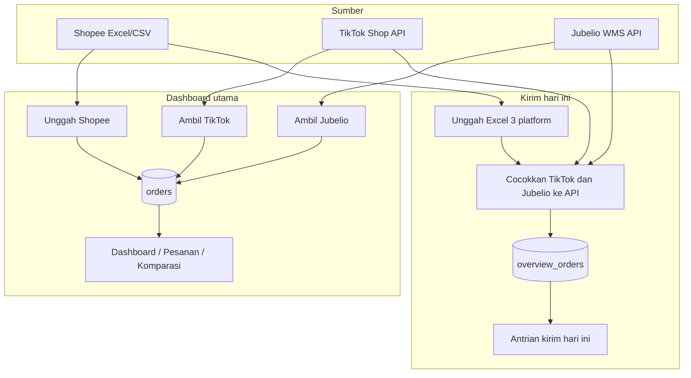
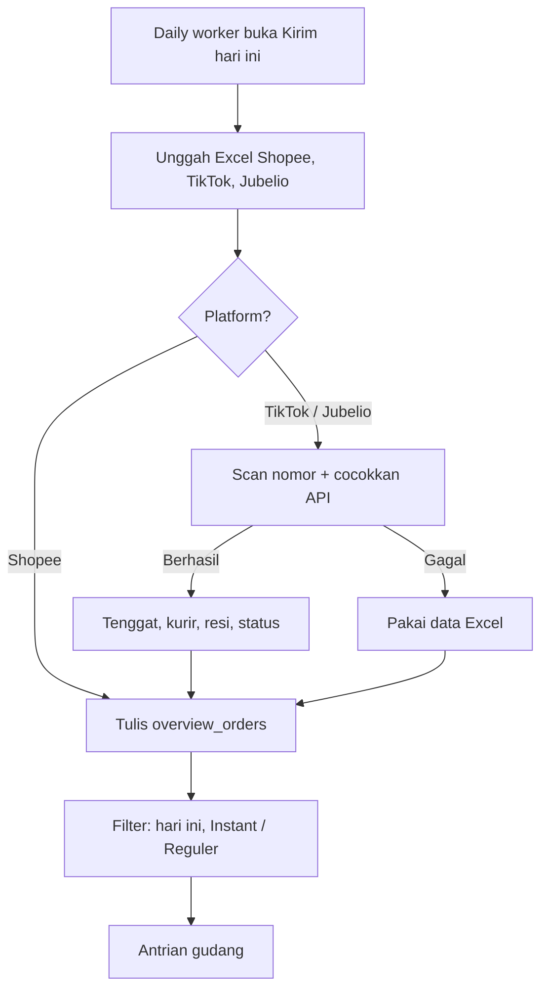

# Order Dashboard - Aeris Beaute Fulfillment

Dashboard webapp untuk mengelola dan menganalisis data order dari marketplace **Shopee**, **TikTok Shop / Tokopedia**, dan **Jubelio**. Data Shopee diimport dari Excel; order TikTok & Tokopedia ditarik dari **TikTok Shop Open API**; order Jubelio ditarik dari **Jubelio WMS API**. Penyimpanan di **Supabase** (PostgreSQL): dashboard utama memakai tabel `orders`, halaman **Kirim hari ini** memakai tabel terpisah `overview_orders`.

**Live**: [fulfillment-order.vercel.app](https://fulfillment-order.vercel.app)

## Alur sistem

Dua jalur data, dua tabel. Dashboard utama dan Kirim hari ini tidak saling menimpa.



### Status live

Ambil data tidak mengupdate status di request yang sama. Status menyusul dari webhook dan cron.


### Kirim hari ini — unggah harian



## Fitur

### Navigasi
- **Dashboard**: Kartu ringkasan + grafik (tren, platform, status)
- **Pesanan**: Tabel order dengan filter, pencarian, dan pagination
- **Komparasi**: Bandingkan Jubelio dengan Shopee / TikTok
- **Settings**: Import Excel Shopee, sync TikTok & Jubelio, export, reset data, profil, password, kelola user
- **Kirim hari ini**: Antrian gudang terpisah (`/overview-duedate`) — dari sidebar terbuka di tab baru

### Sumber Data
- **Shopee**: Import Excel/CSV (drag & drop)
- **TikTok & Tokopedia**: Sync API — tarik order siap dikirim (`AWAITING_SHIPMENT` + `AWAITING_COLLECTION`) dan order **selesai** (`COMPLETED` + `DELIVERED`, 30 hari terakhir). Channel dibaca dari `commerce_platform` (`TIKTOK_SHOP` / `TOKOPEDIA`)
- **Jubelio**: Sync API — tarik order Siap Kirim (`channel_status` Ready To Ship)
- Status live mengikuti webhook TikTok / Jubelio dan cron 15 menit (`/api/refresh-status`)
- **Kirim hari ini**: Excel/CSV wajib dari 3 platform; TikTok & Jubelio dicocokkan ke API realtime

### Dashboard
- Total order, pendapatan, item terjual, dan rata-rata order
- Breakdown per platform (Shopee, TikTok & Tokopedia, Jubelio)
- Grafik tren pendapatan, distribusi platform, distribusi status
- Data dibaca langsung dari Supabase (paralel), disimpan di memori sesi supaya pindah menu tidak fetch ulang

### Pesanan
- Filter platform: Semua | Shopee | TikTok & Tokopedia | Jubelio
- Sub-filter TikTok & Tokopedia: Semua | TikTok Shop by Tokopedia | Tokopedia
- Filter status: Belum Bayar, Perlu Dikirim, Dikirim, Selesai, Batal/Retur
- Sub-filter pengiriman: Instant / Reguler
- Sub-filter pickup: Sebelum Pickup, Sesudah Pickup, Siap Dikirim
- Sorting, pencarian (no. pesanan, customer, SKU, resi), indikator batas kirim, pagination
- Export CSV (Settings)

### Komparasi
- Cocokkan Jubelio vs marketplace via order number, ref number, atau tracking number
- Filter Platform Only: Semua | TikTok & Tokopedia | Shopee, plus sub-filter TTS vs Tokopedia
- Tombol Ambil TikTok dan Ambil Jubelio di halaman yang sama

### Kirim hari ini (`/overview-duedate`)
Halaman kerja daily warehouse. **Data terpisah dari dashboard utama** (Supabase `overview_orders` / `overview_files`, bukan tabel `orders`). Import / hapus di sini tidak mengubah Settings, Pesanan, atau Komparasi.

**Import (wajib 3 platform)**
- Daily worker unggah Excel/CSV Shopee, TikTok, dan Jubelio
- Shopee dipakai apa adanya
- TikTok & Jubelio: backend memindai nomor pesanan dari file, lalu menyamakan dengan data realtime toko/gudang (tenggat, kurir, resi, pickup, status, preorder)
- Kalau API gagal, data Excel tetap dipakai
- Loading memakai skeleton (bukan spinner)

**Yang ditampilkan**
- Hanya pesanan yang perlu dikirim **hari ini** (termasuk preorder yang jatuh tempo hari ini; preorder masa depan disembunyikan)
- Kartu: Perlu dikirim hari ini · Wajib dikirim sekarang · Shopee · TikTok / Tokopedia · Jubelio
- **Shopee / TikTok**: pesanan marketplace yang perlu dikirim hari ini
- **Jubelio**: pesanan yang hanya ada di gudang, belum ketemu pasangan di Shopee / TikTok
- **Wajib dikirim sekarang**: terlambat atau sisa ≤ 1 jam
- **Instant**: kurir instant / same-day (SPX Instant, GoSend, Grab Express, dll.) — bukan Hemat/Standard

**Filter antrian**
- Jenis kirim: Instant · Reguler · Semua
- Platform: Semua · Shopee · TikTok / Tokopedia · Jubelio

Timezone tenggat: `Asia/Jakarta`. Tombol **Hapus data halaman ini** hanya mengosongkan tabel overview.

### Autentikasi & Keamanan
- Login: email/username + password, atau Google OAuth
- Google OAuth hanya untuk domain `@aerisbeaute.com` dan `@fromthisisland.com`
- User harus didaftarkan admin sebelum bisa login (termasuk Google)
- **Admin**: akses penuh
- **Warehouse**: akses penuh, data keuangan disembunyikan
- Reset password via email atau Settings

### TikTok Shop API
- Hubungkan toko sekali di Settings → **Hubungkan TikTok** (OAuth seller, bukan tempel token)
- Izin aplikasi ke toko bisa **Unlimited**; access token API tetap habis ~4 jam
- App memperbarui access token otomatis lewat `refresh_token`
- Redirect URL di aplikasi TikTok: `{origin}/api/tiktok/callback`
- **Ambil TikTok** hanya menambah order baru (siap kirim + selesai 30 hari). Update status tidak digabung di request yang sama (hindari timeout 60 detik Vercel)
- Webhook: `POST /api/tiktok/webhook` — aktifkan Order Status Change, Package Update, Cancellation di Partner Center

### Jubelio WMS API
- Login `POST https://api2.jubelio.com/login` dengan email & password resmi ([docs](https://docs-wms.jubelio.com/))
- Token kadaluarsa 12 jam; app login ulang otomatis 15 menit sebelum expired, atau saat API mengembalikan 401
- Sync menarik daftar sales order Siap Kirim (`GET /sales/orders/`)
- Kredensial hanya di env (`JUBELIO_EMAIL`, `JUBELIO_PASSWORD`), bukan di UI
- Webhook: `POST /api/jubelio/webhook?secret=...` — Jubelio hanya 1 URL; app bisa meneruskan payload ke sistem lama via `JUBELIO_WEBHOOK_FORWARD_URL`

### Lainnya
- PWA (install di desktop/mobile)
- Skeleton loader (dashboard + Kirim hari ini)
- Jam header Kirim hari ini dari `/api/time` (Asia/Jakarta)
- Responsive, tema warm brown/cream

## Tech Stack

- **Framework**: Next.js 14 (App Router)
- **Language**: TypeScript
- **Styling**: Tailwind CSS
- **Animasi**: Framer Motion
- **Database**: Supabase (PostgreSQL + Auth)
- **Charts**: Recharts
- **Excel Parser**: xlsx (SheetJS)
- **Icons**: Lucide React
- **Date Utils**: date-fns
- **Hosting**: Vercel (cron status tiap 15 menit)

## Getting Started

### Prerequisites

- Node.js 18+
- npm
- Supabase project ([supabase.com](https://supabase.com))
- Aplikasi TikTok Shop di [Partner Center](https://partner.tiktokshop.com/) (untuk sync API)

### Installation

```bash
npm install
```

### Environment Variables

Buat file `.env.local`:

```env
NEXT_PUBLIC_SUPABASE_URL=https://your-project.supabase.co
NEXT_PUBLIC_SUPABASE_ANON_KEY=your-anon-key
SUPABASE_SERVICE_ROLE_KEY=your-service-role-key

# TikTok Shop Open API
TIKTOK_APP_KEY=
TIKTOK_APP_SECRET=
TIKTOK_SHOP_CIPHER=
TIKTOK_SERVICE_ID=            # opsional, dari "Copy authorization link"
TIKTOK_BASE_URL=https://open-api.tiktokglobalshop.com
TIKTOK_API_VERSION=202309

# Jubelio WMS / Omnichannel API
JUBELIO_EMAIL=
JUBELIO_PASSWORD=
JUBELIO_BASE_URL=https://api2.jubelio.com
JUBELIO_WEBHOOK_SECRET=       # query ?secret= pada URL webhook
JUBELIO_WEBHOOK_FORWARD_URL=  # opsional; URL sistem lama (bisa koma-pisah)
```

Di Partner Center, Redirect URL boleh:

```
https://fulfillment-order.vercel.app/
https://fulfillment-order.vercel.app/api/tiktok/callback
```

Webhook TikTok:

```
https://fulfillment-order.vercel.app/api/tiktok/webhook
```

Webhook Jubelio (field Pesanan / Create):

```
https://fulfillment-order.vercel.app/api/jubelio/webhook?secret=<JUBELIO_WEBHOOK_SECRET>
```

Keduanya ditangani (callback ke `/` diteruskan ke `/api/tiktok/callback`). Lokal: `http://localhost:3000/` atau `http://localhost:3000/api/tiktok/callback`.

Di **Vercel Environment Variables** hanya simpan kredensial statis. Access token TikTok yang berganti tiap 4 jam **tidak** ditulis ulang ke env Vercel. Setelah **Hubungkan TikTok** / sync, token baru disimpan di Supabase `tiktok_tokens`.

### Database Setup

Jalankan `supabase/migration.sql` di **Supabase Dashboard > SQL Editor** (tabel `orders`, `uploaded_files`, `overview_orders`, `overview_files`, `live_order_status`, `profiles`, `tiktok_tokens`, `jubelio_tokens`, trigger auth).

Kalau database sudah ada, jalankan blok yang belum ada — termasuk **Kirim hari ini** (`overview_orders` / `overview_files`) dan `live_order_status`.

`overview_orders` hanya untuk `/overview-duedate`. Settings / Pesanan / Komparasi tetap di `orders`.

Token Jubelio disimpan di `jubelio_tokens` (production) supaya login 12 jam tidak hilang tiap cold start Vercel.

### Run

```bash
npm run dev
```

Buka [http://localhost:3000](http://localhost:3000).

### Build & Deploy

```bash
npm run build
npm start
```

Untuk Vercel: push ke GitHub, import di Vercel, set environment variables di Settings. Cron di `vercel.json` memanggil `/api/refresh-status` setiap 15 menit.

## Cara Penggunaan

### Import & Sync

**Dashboard utama (Settings / Pesanan / Komparasi)**

| Platform | Sumber | Cara |
|----------|--------|------|
| Shopee | Seller Centre > Pesanan > Export | Settings → upload Excel/CSV |
| Jubelio | Jubelio WMS API (Shipping → Siap Kirim) | Settings / Pesanan / Komparasi → Ambil Jubelio |
| TikTok & Tokopedia | TikTok Shop API (To Ship + Selesai 30 hari) | Settings → Hubungkan TikTok (sekali) → Ambil TikTok |

**Ambil TikTok** menambah order baru saja; status *Terkirim / Selesai* menyusul dari webhook dan cron. Jangan tarik puluhan ribu order selesai sekaligus — sync membatasi halaman supaya tidak kena timeout 60 detik Vercel.

Token Jubelio kadaluarsa 12 jam dan di-login ulang otomatis ([docs WMS](https://docs-wms.jubelio.com/)).

**Kirim hari ini (terpisah)**

| Platform | Sumber | Cara |
|----------|--------|------|
| Shopee | Seller Centre > Pesanan > Export | Unggah Excel/CSV |
| TikTok & Tokopedia | Export Excel/CSV toko | Unggah Excel/CSV → otomatis dicocokkan API |
| Jubelio | Export Excel/CSV gudang | Unggah Excel/CSV → otomatis dicocokkan API |

### Google OAuth Setup

1. Buat OAuth Client ID di [Google Cloud Console](https://console.cloud.google.com/apis/credentials)
2. Set Authorized redirect URI: `https://<supabase-project>.supabase.co/auth/v1/callback`
3. Enable Google provider di Supabase Dashboard > Authentication > Providers
4. Paste Client ID dan Client Secret

### User Management

- Admin membuat user di **Settings > Kelola User > Tambah User**
- User yang belum didaftarkan tidak bisa login (termasuk Google)
- Admin bisa mengubah role dan menghapus user

## Struktur Project

```
src/
├── app/
│   ├── api/
│   │   ├── auth/create-user/     # Create user (admin, server-side)
│   │   ├── orders/               # CRUD order (dashboard utama)
│   │   ├── files/                # Riwayat file upload
│   │   ├── overview/reconcile/   # Cocokkan Excel TikTok/Jubelio dengan API
│   │   ├── overview/orders/      # CRUD pesanan Kirim hari ini
│   │   ├── overview/files/       # Riwayat unggah Kirim hari ini
│   │   ├── overview/live-status/ # Status live webhook untuk overlay
│   │   ├── refresh-status/       # Cron 15 menit (TikTok + Jubelio)
│   │   ├── time/                 # Jam Asia/Jakarta
│   │   ├── jubelio/sync/         # Tarik order Siap Kirim
│   │   ├── jubelio/webhook/      # Status live + forward URL lama
│   │   ├── jubelio/refresh-status/
│   │   └── tiktok/
│   │       ├── authorize/        # Mulai OAuth seller
│   │       ├── callback/         # Tukar auth code → token
│   │       ├── token/            # Status + jaga token tetap fresh
│   │       ├── sync/             # Siap kirim + selesai 30 hari
│   │       ├── webhook/          # Order status change
│   │       └── refresh-status/
│   ├── auth/callback/            # Google OAuth callback
│   ├── login/
│   ├── overview-duedate/         # Kirim hari ini (data terpisah)
│   ├── reset-password/
│   ├── globals.css
│   ├── layout.tsx
│   └── page.tsx                  # Dashboard / Pesanan / Komparasi / Settings
├── components/
│   ├── ApiSyncBar.tsx
│   ├── Charts.tsx
│   ├── ComparisonView.tsx
│   ├── DueDateOverview.tsx       # UI Kirim hari ini
│   ├── FileUpload.tsx            # Import Shopee (dashboard)
│   ├── OrderTable.tsx
│   ├── SettingsView.tsx
│   ├── Sidebar.tsx
│   ├── Skeleton.tsx
│   ├── SummaryCards.tsx
│   └── ServiceWorkerRegistrar.tsx
├── contexts/
│   └── AuthContext.tsx
├── lib/
│   ├── client-data.ts            # Cache memori + load paralel dari Supabase
│   ├── db.ts
│   ├── due-date.ts               # Tenggat, Instant, matching marketplace vs Jubelio
│   ├── excel-parser.ts
│   ├── overview-merge.ts         # Overlay Excel dengan data API
│   ├── overview-store.ts         # Tulis data Kirim hari ini ke Supabase
│   ├── supabase.ts
│   ├── supabase-admin.ts
│   ├── tiktok-api.ts
│   ├── tiktok-auth.ts
│   ├── tiktok-status.ts
│   ├── jubelio-api.ts
│   ├── jubelio-auth.ts
│   ├── jubelio-status.ts
│   └── utils.ts
└── types/
    └── order.ts
public/
├── manifest.json
├── sw.js
└── icons/
supabase/
├── migration.sql
└── seed-admin.sql
vercel.json                       # Cron /api/refresh-status tiap 15 menit
```

## Format Kolom Excel yang Didukung

| Field | Shopee | TikTok Shop (legacy export) | Jubelio |
|-------|--------|-----------------------------|---------|
| No. Pesanan | No. Pesanan | Order ID | salesorder_no |
| Status | Status Pesanan | Order Status | channel_status |
| Customer | Username (Pembeli) | Buyer Username | customer_name |
| Produk | Nama Produk | Product Name | - |
| SKU | Nomor Referensi SKU | Seller SKU | - |
| Qty | Jumlah | Quantity | qty / total_qty |
| Total | Total Pembayaran | Order Amount | grand_total |
| Tanggal | Waktu Pesanan Dibuat | Created Time | transaction_date |
| Batas Kirim | Pesanan Harus Dikirimkan Sebelum | - | due_date |
| No. Resi | No. Resi | Tracking ID | tracking_no |
| Kurir | Opsi Pengiriman | Shipping Provider Name | shipper |
| Ref No | - | - | ref_no |
| Pickup Time | - | RTS Time | pickup_time_store |

## License

MIT
